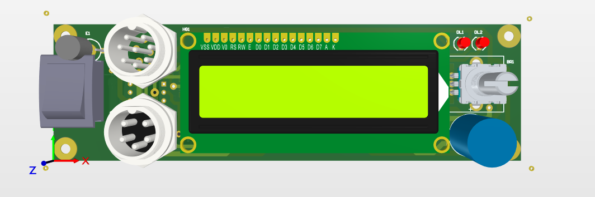
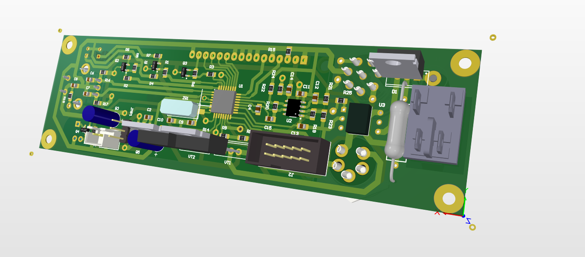
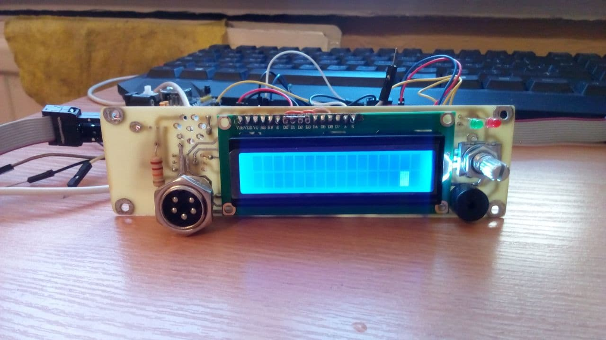
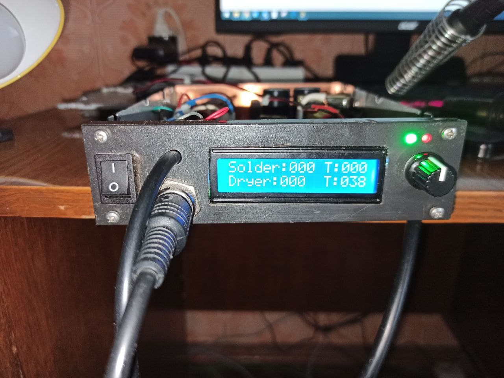
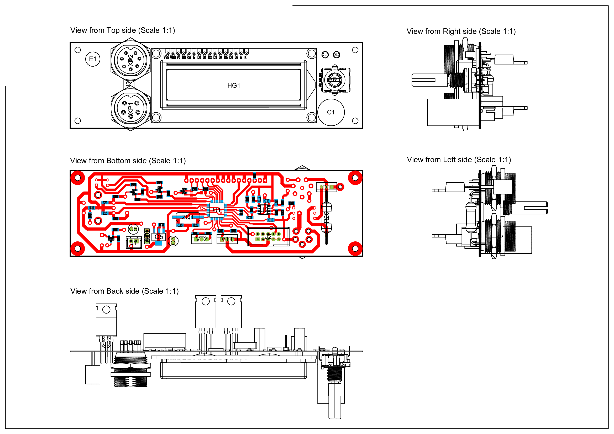

# Soldering_Station

This repository implements Soldering Station with iron soldering and dryer soldering featuring:
 - soldering iron temperature adjustment;
 - dryer soldering temperature adjustment;
 - adjustment of the speed of the dryer soldering.

# 3D model front panel in Altium Dsigner
## Front:

## Back:

# Real appearance:

Firmware in Atmel Studio: [Folder_of_Firmware](Soldering_Station)

Schemes in Altium Designer: [Control_Soldering_iron_and_Soldering_dryer](Control_Soldering_iron_and_Soldering_dryer/Project_Outputs_for_Control_Soldering_iron_and_dryer/Job_dryer_and_iron.PDF)

Altium Designer Project: [Soldering_Station](Control_Soldering_iron_and_Soldering_dryer)

# Printed circuit board 
## Top:

## Bottom:

Original files [here](Control_Soldering_iron_and_Soldering_dryer/Project_Outputs_for_Control_Soldering_iron_and_dryer/)

# Draftsman

Original file [here](Control_Soldering_iron_and_Soldering_dryer/Project_Outputs_for_Control_Soldering_iron_and_dryer/Draf.pdf)
